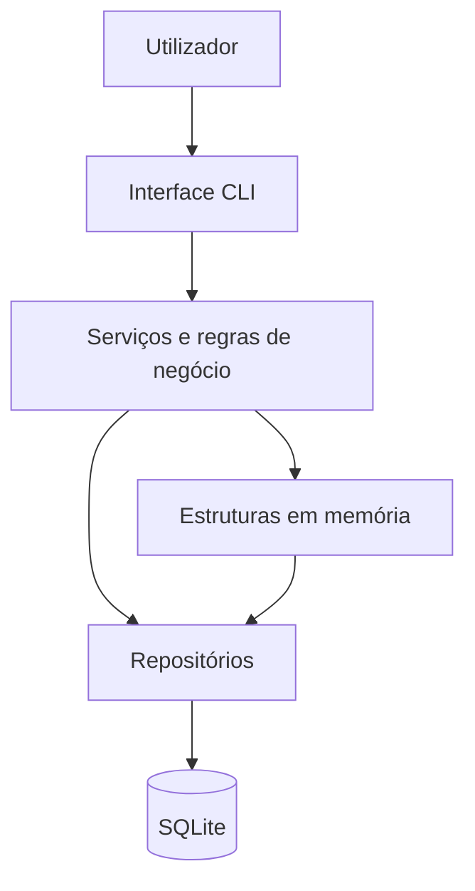

# Stack Tecnológico

## Visão Geral

O picoITSM é uma aplicação académica para gestão de clientes, técnicos,
competências, ativos informáticos e tickets de suporte. A solução segue uma
arquitetura em camadas e utiliza uma interface por linha de comandos.

## Tecnologias

| Área | Tecnologia | Justificação |
|---|---|---|
| Linguagem | Python 3 | Sintaxe simples, boa modularidade e biblioteca padrão abrangente. |
| Base de dados | SQLite | Persistência relacional sem necessidade de instalar um servidor. |
| Interface | CLI | Permite executar as funcionalidades do sistema de forma direta e portátil. |
| Testes | `unittest` | Framework de testes incluída na biblioteca padrão do Python. |
| Controlo de versões | Git e GitHub | Histórico de alterações, alojamento remoto e acompanhamento das entregas. |
| Desenvolvimento | Visual Studio Code | Editor utilizado no desenvolvimento e depuração do projeto. |

Não são necessárias bibliotecas externas para executar a versão atual.

## Arquitetura

O projeto utiliza uma arquitetura modular em camadas:

- `models`: entidades do domínio.
- `menus`: interface e navegação da aplicação.
- `services`: regras de negócio, cache e atribuição automática.
- `repositories`: operações de persistência.
- `database`: criação, ligação e dados iniciais da base de dados.
- `utils`: validação e funções de segurança.
- `tests`: testes automatizados.

## Algoritmo Principal

A atribuição automática seleciona técnicos ativos e disponíveis que possuam a
competência necessária. Os candidatos são colocados numa fila de prioridade
(`heap`), ordenada pela carga de tickets ainda não fechados. Em caso de empate,
é utilizado o identificador do técnico para garantir uma escolha determinística.

## Portabilidade

A aplicação foi desenhada para funcionar em Windows, Linux e macOS, desde que
esteja instalada uma versão compatível do Python 3. A base de dados é guardada
num único ficheiro SQLite dentro da pasta `database`.
