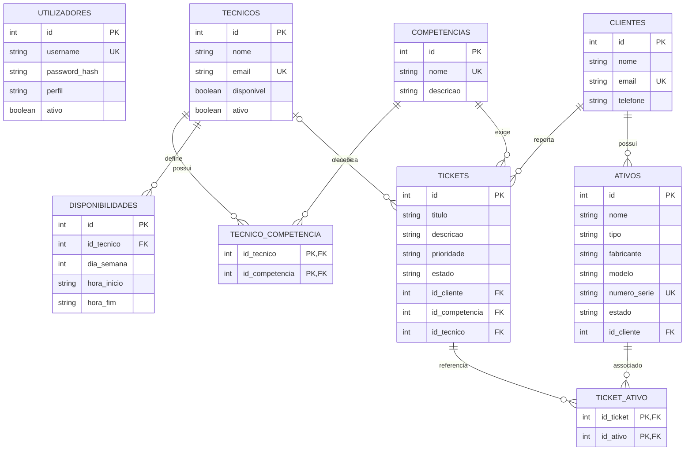

# Diagrama Entidade-Relacionamento

## Modelo de Dados Completo

O diagrama seguinte representa o modelo normalizado previsto para o âmbito
completo do picoITSM. As entidades `ATIVOS`, `DISPONIBILIDADES` e a associação
`TICKET_ATIVO` estão modeladas para cumprir o registo de infraestrutura e a
disponibilidade horária do enunciado, mas ainda não foram implementadas na base
de dados atual.

## Entidades Implementadas

| Entidade | Finalidade | Estado |
|---|---|---|
| `utilizadores` | Autenticação e perfil de acesso. | Implementada |
| `tecnicos` | Técnicos que podem receber tickets. | Implementada |
| `clientes` | Entidades que reportam pedidos de suporte. | Implementada |
| `competencias` | Áreas técnicas necessárias para resolver tickets. | Implementada |
| `tecnico_competencia` | Relação muitos-para-muitos entre técnicos e competências. | Implementada |
| `tickets` | Incidentes e pedidos de suporte. | Implementada |
| `disponibilidades` | Horários em que cada técnico pode receber trabalho. | Por implementar |
| `ativos` | Inventário de hardware e software dos clientes. | Por implementar |
| `ticket_ativo` | Relação entre tickets e ativos afetados. | Por implementar |

## Normalização

O modelo segue a terceira forma normal:

1. Cada campo contém um valor atómico e cada tabela possui uma chave primária.
2. As relações muitos-para-muitos são separadas em tabelas associativas.
3. Dados de clientes, técnicos e competências não são repetidos nos tickets;
   são referenciados através de chaves estrangeiras.
4. A disponibilidade horária é separada do técnico porque um técnico pode ter
   vários períodos de disponibilidade.
5. A associação entre tickets e ativos é separada para permitir que um ticket
   envolva vários ativos e que um ativo apareça em vários tickets.

## Restrições Principais

- `username`, emails, nomes de competência e números de série são únicos.
- Um ticket tem obrigatoriamente cliente e competência.
- A atribuição de técnico é opcional quando não existe candidato elegível.
- As tabelas associativas utilizam chaves primárias compostas para impedir
  associações duplicadas.
