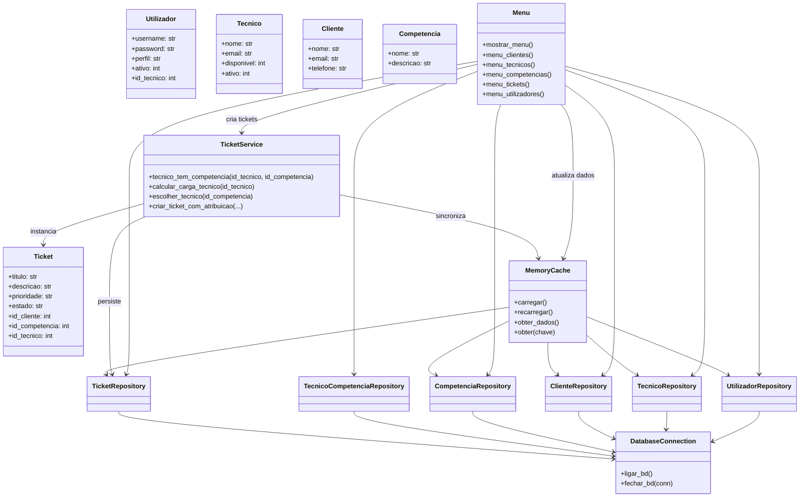
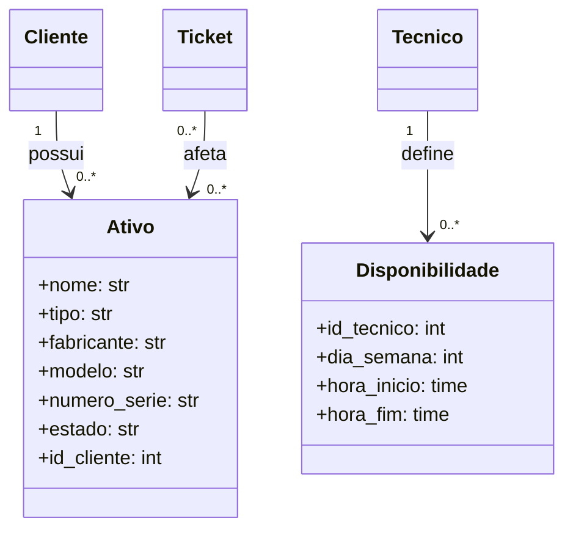

# Diagrama de Classes

## Lógica de Domínio e Arquitetura

O diagrama representa as classes existentes na versão atual. Ao contrário da
versão inicial deste documento, não inclui métodos ou classes que não estejam
presentes no código.

## Entidades Previstas no Âmbito Completo

As classes seguintes resultam dos requisitos do enunciado e deverão ser
adicionadas quando o inventário e a disponibilidade horária forem implementados:

## Responsabilidades

- As entidades transportam os dados do domínio.
- O `Menu` gere a interação e valida os dados introduzidos.
- O `TicketService` contém o algoritmo de atribuição automática.
- A `MemoryCache` mantém em memória os dados carregados da base de dados.
- Os repositórios isolam as operações SQL.
- A `DatabaseConnection` centraliza a abertura e o fecho das ligações SQLite.
