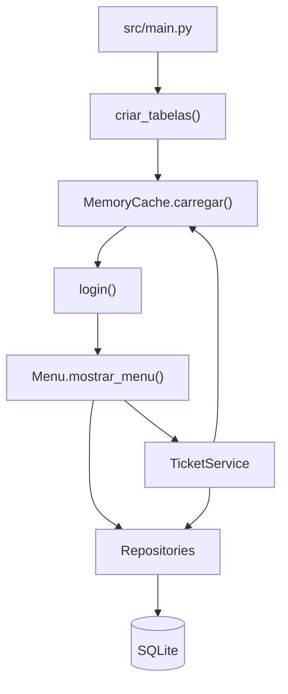

# Guia do Código e Objetos Públicos

## Objetivo

Este documento explica a estrutura do projeto picoITSM, a função de cada
ficheiro e os objetos públicos disponíveis no código. Serve como apoio à
defesa do projeto e como referência rápida para perceber onde está cada parte
da aplicação.

## Árvore do Projeto Explicada

```text
picoITSM/
├── README.md
├── Proposta de Projeto - 10790.pdf
├── database/
│   └── picoitsm.db
├── docs/
│   ├── 01_stack_tecnologico.md
│   ├── 02_requisitos.md
│   ├── 03_diagrama_entidade_relacionamento.md
│   ├── 04_diagrama_classes.md
│   ├── 05_repositorio_e_scaffold.md
│   └── 06_guia_codigo_e_objetos.md
└── src/
    ├── main.py
    ├── database/
    ├── menus/
    ├── models/
    ├── repositories/
    ├── services/
    ├── tests/
    └── utils/
```

| Caminho | Para que serve |
|---|---|
| `README.md` | Apresenta o projeto, tecnologias usadas, utilizadores de teste, estado das entregas e comandos principais. |
| `Proposta de Projeto - 10790.pdf` | Enunciado original da UFCD com os objetivos e critérios das entregas. |
| `database/picoitsm.db` | Ficheiro SQLite onde ficam guardados utilizadores, técnicos, clientes, competências, associações e tickets. |
| `docs/01_stack_tecnologico.md` | Explica a stack usada, arquitetura geral, camadas e algoritmo principal. |
| `docs/02_requisitos.md` | Lista requisitos funcionais, não-funcionais, regras de negócio e critérios de aceitação. |
| `docs/03_diagrama_entidade_relacionamento.md` | Descreve o modelo de dados e as relações entre entidades. |
| `docs/04_diagrama_classes.md` | Mostra a organização das classes e a relação entre menus, serviços, repositórios e modelos. |
| `docs/05_repositorio_e_scaffold.md` | Explica a estrutura inicial do projeto e o repositório Git/GitHub. |
| `docs/06_guia_codigo_e_objetos.md` | Este documento. Explica ficheiros, classes, funções, métodos e parâmetros públicos. |
| `src/main.py` | Ponto de entrada da aplicação. Cria a base de dados, carrega a cache, faz login e abre o menu principal. |
| `src/database/db_connection.py` | Centraliza a abertura e fecho de ligações à base de dados SQLite. |
| `src/database/init_db.py` | Cria as tabelas necessárias caso ainda não existam. |
| `src/database/seed_db.py` | Insere dados de teste na base de dados. |
| `src/menus/menu.py` | Implementa toda a interface por consola, menus, validação de entradas e chamadas aos repositórios/serviços. |
| `src/models/cliente.py` | Modelo de dados para clientes. |
| `src/models/competencia.py` | Modelo de dados para competências técnicas. |
| `src/models/tecnico.py` | Modelo de dados para técnicos. |
| `src/models/ticket.py` | Modelo de dados para tickets. |
| `src/models/utilizador.py` | Modelo de dados para utilizadores da aplicação. |
| `src/repositories/cliente_repository.py` | CRUD de clientes na base de dados. |
| `src/repositories/competencia_repository.py` | CRUD de competências na base de dados. |
| `src/repositories/tecnico_repository.py` | CRUD de técnicos na base de dados. |
| `src/repositories/tecnico_competencia_repository.py` | Gere a associação entre técnicos e competências. |
| `src/repositories/ticket_repository.py` | CRUD de tickets na base de dados. |
| `src/repositories/utilizador_repository.py` | CRUD de utilizadores e autenticação. |
| `src/services/memory_cache.py` | Carrega dados da base de dados para memória e mantém a aplicação sincronizada. |
| `src/services/ticket_service.py` | Contém a regra principal de atribuição automática de tickets. |
| `src/tests/test_ticket_service.py` | Testes unitários do algoritmo de atribuição automática. |
| `src/tests/test_menu_autorizacao.py` | Testes de visibilidade de tickets por perfil. |
| `src/tests/test_security_logger_validators.py` | Testes de segurança, logger e validações. |
| `src/utils/logger.py` | Regista alterações de dados num ficheiro de log em texto. |
| `src/utils/security.py` | Funções auxiliares de segurança, como geração de hash de passwords. |
| `src/utils/validators.py` | Funções de validação usadas pelos menus. |

## Fluxo Principal da Aplicação



## Modelos

Os modelos são objetos simples que guardam dados antes de estes serem enviados
para os repositórios.

### `Cliente`

Ficheiro: `src/models/cliente.py`

Representa um cliente que reporta tickets.

| Parâmetro | Tipo esperado | Obrigatório | Explicação |
|---|---|---|---|
| `nome` | `str` | Sim | Nome do cliente. |
| `email` | `str` | Sim | Email único do cliente. |
| `telefone` | `str` | Não | Contacto telefónico. Valor por defeito: `""`. |

Uso:

```python
cliente = Cliente("Empresa Alpha", "geral@alpha.pt", "912345678")
```

### `Competencia`

Ficheiro: `src/models/competencia.py`

Representa uma área técnica necessária para resolver tickets.

| Parâmetro | Tipo esperado | Obrigatório | Explicação |
|---|---|---|---|
| `nome` | `str` | Sim | Nome da competência, por exemplo `Redes`. |
| `descricao` | `str` | Não | Descrição da competência. Valor por defeito: `""`. |

Uso:

```python
competencia = Competencia("Redes", "Administração e suporte de redes")
```

### `Tecnico`

Ficheiro: `src/models/tecnico.py`

Representa um técnico que pode receber tickets.

| Parâmetro | Tipo esperado | Obrigatório | Explicação |
|---|---|---|---|
| `nome` | `str` | Sim | Nome do técnico. |
| `email` | `str` | Sim | Email único do técnico. |
| `disponivel` | `int` | Não | `1` para disponível, `0` para indisponível. Valor por defeito: `1`. |
| `ativo` | `int` | Não | `1` para ativo, `0` para inativo. Valor por defeito: `1`. |

Uso:

```python
tecnico = Tecnico("João Silva", "joao@picoitsm.pt", 1, 1)
```

### `Ticket`

Ficheiro: `src/models/ticket.py`

Representa um incidente ou pedido de suporte.

| Parâmetro | Tipo esperado | Obrigatório | Explicação |
|---|---|---|---|
| `titulo` | `str` | Sim | Título curto do ticket. |
| `descricao` | `str` | Sim | Descrição do problema. |
| `prioridade` | `str` | Sim | Prioridade: `BAIXA`, `MEDIA` ou `ALTA`. |
| `id_cliente` | `int` | Sim | ID do cliente associado. |
| `id_competencia` | `int` | Sim | ID da competência necessária. |
| `id_tecnico` | `int` ou `None` | Não | Técnico atribuído. Valor por defeito: `None`. |
| `estado` | `str` | Não | Estado do ticket. Valor por defeito: `ABERTO`. |

Uso:

```python
ticket = Ticket("Sem acesso à rede", "Cliente sem rede interna", "ALTA", 1, 1)
```

### `Utilizador`

Ficheiro: `src/models/utilizador.py`

Representa um utilizador que pode iniciar sessão.

| Parâmetro | Tipo esperado | Obrigatório | Explicação |
|---|---|---|---|
| `username` | `str` | Sim | Nome de utilizador usado no login. |
| `password` | `str` | Sim | Password antes de ser transformada em hash. |
| `perfil` | `str` | Sim | Perfil: `ADMIN` ou `TECNICO`. |
| `ativo` | `int` | Não | `1` para ativo, `0` para inativo. Valor por defeito: `1`. |
| `id_tecnico` | `int` ou `None` | Não | Técnico associado ao utilizador quando o perfil é `TECNICO`. |

Uso:

```python
utilizador = Utilizador("admin", "admin123", "ADMIN")
utilizador_tecnico = Utilizador("user", "user123", "TECNICO", id_tecnico=1)
```

## Base de Dados

### `DatabaseConnection`

Ficheiro: `src/database/db_connection.py`

Classe utilitária para abrir e fechar ligações SQLite.

| Método | Parâmetros | Retorno | Para que serve | Como se usa |
|---|---|---|---|---|
| `ligar_bd()` | Nenhum | Ligação SQLite | Abre a ligação ao ficheiro `database/picoitsm.db`. | `conn = DatabaseConnection.ligar_bd()` |
| `fechar_bd(conn)` | `conn`: ligação SQLite | Nenhum | Fecha a ligação se ela existir. | `DatabaseConnection.fechar_bd(conn)` |

### Funções de `init_db.py`

Ficheiro: `src/database/init_db.py`

| Função | Parâmetros | Retorno | Para que serve | Como se usa |
|---|---|---|---|---|
| `adicionar_coluna_se_nao_existir(cursor, tabela, coluna, definicao)` | `cursor`, `tabela`, `coluna`, `definicao` | Nenhum | Verifica se uma coluna já existe numa tabela e adiciona-a se estiver em falta. | Usada internamente por `criar_tabelas()`. |
| `criar_tabelas()` | Nenhum | Nenhum | Cria as tabelas principais do sistema se ainda não existirem. | `criar_tabelas()` |

### Funções de `seed_db.py`

Ficheiro: `src/database/seed_db.py`

| Função | Parâmetros | Retorno | Para que serve | Como se usa |
|---|---|---|---|---|
| `obter_id_por_nome(tabela, nome)` | `tabela`: nome da tabela; `nome`: valor a pesquisar | `int` ou `None` | Procura o ID de um registo através do campo `nome`. | `id_redes = obter_id_por_nome("competencias", "Redes")` |
| `associar_tecnico_competencia(id_tecnico, id_competencia)` | IDs do técnico e da competência | Nenhum | Cria a associação entre um técnico e uma competência. | `associar_tecnico_competencia(1, 2)` |
| `associar_utilizador_tecnico(username, id_tecnico)` | Username e ID do técnico | Nenhum | Liga um utilizador técnico ao técnico correspondente. | `associar_utilizador_tecnico("user", 1)` |
| `seed()` | Nenhum | Nenhum | Cria as tabelas e insere dados iniciais de teste. | `seed()` ou `python src/database/seed_db.py` |

## Repositórios

Os repositórios são responsáveis por comunicar com a base de dados. O menu e os
serviços usam estas classes para criar, listar, atualizar ou remover dados.

### `ClienteRepository`

Ficheiro: `src/repositories/cliente_repository.py`

| Método | Parâmetros | Retorno | Para que serve |
|---|---|---|---|
| `criar(cliente)` | `cliente`: objeto `Cliente` | Nenhum | Insere um cliente na base de dados. |
| `listar()` | Nenhum | Lista de tuplos | Devolve todos os clientes. |
| `atualizar(id_cliente, nome, email, telefone)` | ID e novos dados | Nenhum | Atualiza os dados de um cliente existente. |
| `remover(id_cliente)` | ID do cliente | Nenhum | Remove o cliente indicado. |

Uso:

```python
repo = ClienteRepository()
repo.criar(Cliente("Empresa Alpha", "geral@alpha.pt", "912345678"))
clientes = repo.listar()
```

### `CompetenciaRepository`

Ficheiro: `src/repositories/competencia_repository.py`

| Método | Parâmetros | Retorno | Para que serve |
|---|---|---|---|
| `criar(competencia)` | `competencia`: objeto `Competencia` | Nenhum | Insere uma competência na base de dados. |
| `listar()` | Nenhum | Lista de tuplos | Devolve todas as competências. |
| `atualizar(id_competencia, nome, descricao)` | ID e novos dados | Nenhum | Atualiza uma competência existente. |
| `remover(id_competencia)` | ID da competência | Nenhum | Remove a competência indicada. |

### `TecnicoRepository`

Ficheiro: `src/repositories/tecnico_repository.py`

| Método | Parâmetros | Retorno | Para que serve |
|---|---|---|---|
| `criar(tecnico)` | `tecnico`: objeto `Tecnico` | Nenhum | Insere um técnico na base de dados. |
| `listar()` | Nenhum | Lista de tuplos | Devolve todos os técnicos. |
| `obter_por_email(email)` | Email do técnico | Tuplo ou `None` | Procura um técnico através do email. |
| `atualizar(id_tecnico, nome, email, disponivel, ativo)` | ID e novos dados | Nenhum | Atualiza um técnico existente. |
| `remover(id_tecnico)` | ID do técnico | Nenhum | Remove o técnico indicado. |

### `TecnicoCompetenciaRepository`

Ficheiro: `src/repositories/tecnico_competencia_repository.py`

| Método | Parâmetros | Retorno | Para que serve |
|---|---|---|---|
| `associar(id_tecnico, id_competencia)` | IDs do técnico e da competência | Nenhum | Associa uma competência a um técnico. |
| `remover(id_tecnico, id_competencia)` | IDs do técnico e da competência | Nenhum | Remove uma associação existente. |
| `listar()` | Nenhum | Lista de tuplos | Lista todas as associações. |
| `listar_por_tecnico(id_tecnico)` | ID do técnico | Lista de tuplos | Lista as competências de um técnico específico. |

### `TicketRepository`

Ficheiro: `src/repositories/ticket_repository.py`

| Método | Parâmetros | Retorno | Para que serve |
|---|---|---|---|
| `criar(ticket)` | `ticket`: objeto `Ticket` | Nenhum | Insere um ticket na base de dados. |
| `listar()` | Nenhum | Lista de tuplos | Devolve tickets com nomes de cliente, competência e técnico. |
| `atualizar(id_ticket, titulo, descricao, prioridade, estado, id_cliente, id_competencia, id_tecnico)` | ID e novos dados | Nenhum | Atualiza um ticket existente. |
| `remover(id_ticket)` | ID do ticket | Nenhum | Remove o ticket indicado. |

### `UtilizadorRepository`

Ficheiro: `src/repositories/utilizador_repository.py`

| Método/Função | Parâmetros | Retorno | Para que serve |
|---|---|---|---|
| `criar(utilizador)` | `utilizador`: objeto `Utilizador` | Nenhum | Guarda um utilizador com password em hash. |
| `listar()` | Nenhum | Lista de tuplos | Lista utilizadores sem mostrar passwords, incluindo o técnico associado. |
| `atualizar(id_utilizador, username, perfil, ativo, id_tecnico=None)` | ID e novos dados | Nenhum | Atualiza username, perfil, estado ativo e técnico associado. |
| `remover(id_utilizador)` | ID do utilizador | Nenhum | Remove um utilizador. |
| `autenticar(username, password)` | Credenciais de login | Tuplo ou `None` | Valida username/password e devolve o utilizador ativo com o `id_tecnico`. |
| `criar_utilizador(username, password, perfil, id_tecnico=None)` | Dados do utilizador | Nenhum | Função auxiliar para criar utilizadores sem instanciar o repositório manualmente. |

Uso:

```python
repo = UtilizadorRepository()
utilizador = repo.autenticar("admin", "admin123")
```

## Serviços

### `MemoryCache`

Ficheiro: `src/services/memory_cache.py`

Mantém uma cópia dos dados principais em memória para a aplicação consultar sem
ter de fazer sempre novas queries.

| Método | Parâmetros | Retorno | Para que serve |
|---|---|---|---|
| `carregar()` | Nenhum | Nenhum | Carrega utilizadores, técnicos, clientes, competências, associações e tickets. |
| `carregar_tecnico_competencia()` | Nenhum | Lista de tuplos | Carrega a tabela associativa `tecnico_competencia`. |
| `limpar()` | Nenhum | Nenhum | Esvazia as listas guardadas em memória. |
| `recarregar()` | Nenhum | Nenhum | Limpa e volta a carregar todos os dados. |
| `obter_dados()` | Nenhum | `dict` | Devolve toda a estrutura de dados em memória. |
| `obter(chave)` | `chave`: nome da lista | Lista | Devolve uma lista específica, por exemplo `tickets`. |
| `resumo()` | Nenhum | Nenhum | Mostra na consola a quantidade de registos por lista. |

Uso:

```python
cache = MemoryCache()
cache.carregar()
dados = cache.obter_dados()
```

### `TicketService`

Ficheiro: `src/services/ticket_service.py`

Contém o algoritmo principal da aplicação: escolher automaticamente o técnico
mais adequado para um ticket.

| Método | Parâmetros | Retorno | Para que serve |
|---|---|---|---|
| `tecnico_tem_competencia(id_tecnico, id_competencia)` | IDs do técnico e da competência | `bool` | Verifica se um técnico tem a competência exigida. |
| `calcular_carga_tecnico(id_tecnico)` | ID do técnico | `int` | Conta quantos tickets não fechados estão atribuídos ao técnico. |
| `escolher_tecnico(id_competencia)` | ID da competência necessária | `dict` ou `None` | Escolhe o técnico ativo, disponível, competente e com menor carga. |
| `criar_ticket_com_atribuicao(titulo, descricao, prioridade, id_cliente, id_competencia)` | Dados do ticket | `dict` ou `None` | Cria o ticket e tenta atribuí-lo automaticamente. |

Uso:

```python
service = TicketService(dados, cache)
tecnico = service.escolher_tecnico(1)
```

## Menu e Interface

### `Menu`

Ficheiro: `src/menus/menu.py`

Classe que gere a interação por consola. Recebe o utilizador autenticado, os
dados carregados e, opcionalmente, a cache.

Construtor:

```python
Menu(utilizador_atual, dados, cache=None)
```

| Parâmetro | Explicação |
|---|---|
| `utilizador_atual` | Tuplo do utilizador autenticado: ID, username, perfil e ativo. |
| `dados` | Dicionário com listas carregadas pela `MemoryCache`. |
| `cache` | Objeto `MemoryCache`, usado para recarregar dados depois de alterações. |

#### Navegação e menus

| Método | Parâmetros | Para que serve |
|---|---|---|
| `limpar_ecra()` | Nenhum | Limpa a consola. |
| `eh_admin()` | Nenhum | Verifica se o utilizador atual tem perfil `ADMIN`. |
| `desenhar_menu()` | Nenhum | Mostra o menu principal. |
| `mostrar_menu()` | Nenhum | Controla o ciclo principal da aplicação. |
| `desenhar_menu_tecnicos()` | Nenhum | Mostra opções de técnicos. |
| `desenhar_menu_clientes()` | Nenhum | Mostra opções de clientes. |
| `desenhar_menu_tickets()` | Nenhum | Mostra opções de tickets. |
| `desenhar_menu_competencias()` | Nenhum | Mostra opções de competências. |
| `desenhar_menu_utilizadores()` | Nenhum | Mostra opções de utilizadores. |
| `menu_tecnicos()` | Nenhum | Controla o submenu de técnicos. |
| `menu_clientes()` | Nenhum | Controla o submenu de clientes. |
| `menu_tickets()` | Nenhum | Controla o submenu de tickets. |
| `menu_competencias()` | Nenhum | Controla o submenu de competências. |
| `menu_competencias_tecnico()` | Nenhum | Controla a gestão de competências associadas a técnicos. |
| `menu_utilizadores()` | Nenhum | Controla o submenu de utilizadores. |
| `obter_id_tecnico_utilizador_atual()` | Nenhum | Obtém o técnico associado ao utilizador autenticado. |
| `exigir_admin()` | Nenhum | Bloqueia operações administrativas para utilizadores que não sejam `ADMIN`. |

#### Operações de técnicos

| Método | Parâmetros | Para que serve |
|---|---|---|
| `listar_tecnicos()` | Nenhum | Mostra todos os técnicos. |
| `adicionar_tecnico()` | Nenhum | Pede dados na consola, cria técnico e cria utilizador padrão. |
| `editar_tecnico()` | Nenhum | Permite alterar nome, email, disponibilidade e estado ativo. |
| `excluir_tecnico()` | Nenhum | Remove um técnico se não existirem relações impeditivas. |
| `criar_utilizador_padrao_tecnico(email)` | `email` | Cria um utilizador técnico com username derivado do email. |

#### Operações de competências por técnico

| Método | Parâmetros | Para que serve |
|---|---|---|
| `listar_competencias_tecnico()` | Nenhum | Mostra associações entre técnicos e competências. |
| `associar_competencia_tecnico()` | Nenhum | Associa uma competência existente a um técnico existente. |
| `remover_competencia_tecnico()` | Nenhum | Remove uma associação entre técnico e competência. |

#### Operações de clientes

| Método | Parâmetros | Para que serve |
|---|---|---|
| `listar_clientes()` | Nenhum | Mostra todos os clientes. |
| `adicionar_cliente()` | Nenhum | Pede dados e cria um cliente. |
| `editar_cliente()` | Nenhum | Permite alterar nome, email e telefone. |
| `excluir_cliente()` | Nenhum | Remove um cliente se não tiver tickets associados. |

#### Operações de competências

| Método | Parâmetros | Para que serve |
|---|---|---|
| `listar_competencias()` | Nenhum | Mostra todas as competências. |
| `adicionar_competencia()` | Nenhum | Pede dados e cria uma competência. |
| `editar_competencia()` | Nenhum | Permite alterar nome e descrição. |
| `excluir_competencia()` | Nenhum | Remove uma competência se não tiver relações impeditivas. |

#### Operações de tickets

| Método | Parâmetros | Para que serve |
|---|---|---|
| `listar_tickets()` | Nenhum | Mostra todos os tickets. |
| `adicionar_ticket()` | Nenhum | Cria um ticket e chama a atribuição automática. |
| `editar_ticket()` | Nenhum | Permite alterar dados e técnico atribuído. |
| `alterar_estado_ticket()` | Nenhum | Altera o estado para `ABERTO`, `EM_CURSO` ou `FECHADO`. |
| `fechar_ticket()` | Nenhum | Define diretamente o estado como `FECHADO`. |
| `excluir_ticket()` | Nenhum | Remove um ticket. |

Nota: administradores visualizam todos os tickets. Utilizadores com perfil
`TECNICO` visualizam e acedem apenas aos tickets atribuídos ao seu `id_tecnico`.

#### Operações de utilizadores

| Método | Parâmetros | Para que serve |
|---|---|---|
| `adicionar_administrador()` | Nenhum | Cria um utilizador com perfil `ADMIN`. |
| `adicionar_utilizador_tecnico()` | Nenhum | Cria um utilizador com perfil `TECNICO`. |
| `adicionar_utilizador_com_perfil(perfil)` | `perfil`: `ADMIN` ou `TECNICO` | Pede username/password e cria o utilizador. |
| `listar_utilizadores()` | Nenhum | Mostra utilizadores sem revelar passwords. |
| `editar_utilizador()` | Nenhum | Permite alterar username, perfil e estado ativo. |
| `excluir_utilizador()` | Nenhum | Remove um utilizador, exceto o utilizador com sessão iniciada. |

#### Leitura e validação de entradas

| Método | Parâmetros | Retorno | Para que serve |
|---|---|---|---|
| `ler_numero(mensagem)` | Texto apresentado ao utilizador | `int` | Lê até receber um número válido. |
| `ler_numero_positivo(mensagem)` | Texto apresentado ao utilizador | `int` | Lê até receber um inteiro positivo. |
| `ler_booleano(mensagem)` | Texto apresentado ao utilizador | `int` | Lê `1` ou `0`. |
| `ler_texto_obrigatorio(mensagem)` | Texto apresentado ao utilizador | `str` | Lê texto não vazio. |
| `ler_texto_opcional(campo, valor_atual)` | Nome do campo e valor atual | `str` | Permite manter o valor atual se o utilizador não escrever nada. |
| `ler_texto_livre_opcional(campo, valor_atual)` | Nome do campo e valor atual | `str` | Igual ao anterior, mas pensado para descrições/texto livre. |
| `ler_email(mensagem)` | Texto apresentado ao utilizador | `str` | Lê até receber email válido. |
| `ler_email_opcional(campo, valor_atual)` | Nome do campo e valor atual | `str` | Permite manter email atual ou escrever um novo email válido. |
| `ler_prioridade(mensagem)` | Texto apresentado ao utilizador | `str` | Lê prioridade válida. |
| `ler_prioridade_opcional(campo, valor_atual)` | Nome do campo e valor atual | `str` | Permite manter ou alterar prioridade. |
| `ler_estado_ticket(mensagem)` | Texto apresentado ao utilizador | `str` | Lê estado válido do ticket. |
| `ler_estado_ticket_opcional(campo, valor_atual)` | Nome do campo e valor atual | `str` | Permite manter ou alterar estado. |
| `ler_perfil_utilizador(mensagem)` | Texto apresentado ao utilizador | `str` | Lê `ADMIN` ou `TECNICO`. |
| `ler_perfil_utilizador_opcional(campo, valor_atual)` | Nome do campo e valor atual | `str` | Permite manter ou alterar perfil. |
| `ler_id_existente(chave, mensagem)` | Lista em `dados` e mensagem | `int` | Lê um ID que exista na lista indicada. |
| `ler_booleano_opcional(campo, valor_atual)` | Nome do campo e valor atual | `int` | Permite manter ou alterar valor `1`/`0`. |
| `ler_id_existente_opcional(chave, campo, valor_atual)` | Lista, campo e valor atual | `int` | Permite manter ou alterar um ID existente. |
| `ler_id_tecnico_opcional(mensagem)` | Texto apresentado ao utilizador | `int` ou `None` | Lê técnico ou aceita `0` para sem técnico. |
| `ler_id_tecnico_opcional_com_atual(campo, valor_atual)` | Campo e valor atual | `int` ou `None` | Mantém, altera ou remove técnico atribuído. |

#### Consultas auxiliares

| Método | Parâmetros | Retorno | Para que serve |
|---|---|---|---|
| `existe_id(chave, id_registo)` | Lista em `dados` e ID | `bool` | Verifica se existe um registo com aquele ID. |
| `mostrar_tecnicos()` | Nenhum | Nenhum | Mostra técnicos disponíveis para escolha. |
| `mostrar_competencias()` | Nenhum | Nenhum | Mostra competências disponíveis para escolha. |
| `obter_nome_por_id(chave, id_registo)` | Lista em `dados` e ID | `str` | Procura o nome de um registo. |
| `obter_registo_por_id(chave, id_registo)` | Lista em `dados` e ID | Tuplo ou `None` | Procura o registo completo. |
| `obter_tickets_visiveis()` | Nenhum | Lista de tuplos | Devolve todos os tickets para `ADMIN` ou apenas os tickets do técnico autenticado. |
| `ticket_esta_visivel(id_ticket)` | ID do ticket | `bool` | Verifica se o utilizador atual pode aceder ao ticket. |
| `ler_id_ticket_visivel(mensagem)` | Texto apresentado ao utilizador | `int` ou `None` | Lê um ticket existente e permitido para o perfil atual. |
| `cliente_tem_tickets(id_cliente)` | ID do cliente | `bool` | Verifica se o cliente tem tickets associados. |
| `tecnico_tem_tickets(id_tecnico)` | ID do técnico | `bool` | Verifica se o técnico tem tickets associados. |
| `competencia_tem_tickets(id_competencia)` | ID da competência | `bool` | Verifica se a competência é usada em tickets. |
| `tecnico_tem_competencias(id_tecnico)` | ID do técnico | `bool` | Verifica se o técnico tem competências associadas. |
| `competencia_tem_tecnicos(id_competencia)` | ID da competência | `bool` | Verifica se a competência está associada a técnicos. |
| `recarregar_dados()` | Nenhum | Nenhum | Atualiza `dados` após alterações na base de dados. |

## Utilitários

### `Logger`

Ficheiro: `src/utils/logger.py`

Regista alterações feitas na aplicação no ficheiro `logs/picoitsm.log`.
É usado pelos repositórios quando há criação, atualização, remoção ou
associação de dados.

| Método | Parâmetros | Retorno | Para que serve | Como se usa |
|---|---|---|---|---|
| `definir_utilizador(utilizador)` | Tuplo do utilizador autenticado | Nenhum | Guarda o utilizador atual numa variável da classe `Logger`. | `Logger.definir_utilizador(utilizador_atual)` |
| `obter_nome_utilizador()` | Nenhum | `str` | Devolve o username atual ou `SISTEMA` quando ainda não há sessão. | `Logger.obter_nome_utilizador()` |
| `registar(acao, entidade, detalhes="")` | `acao`: tipo de alteração; `entidade`: tabela ou área afetada; `detalhes`: texto opcional | Nenhum | Escreve uma linha no log com data/hora, utilizador, ação, entidade e detalhes. | `Logger.registar("CRIAR", "clientes", "id=1, nome=Empresa Alpha")` |

Exemplo de linha gerada:

```text
2026-06-12 10:30:00 | admin | CRIAR | clientes | id=1, nome=Empresa Alpha
```

### `SecurityUtils`

Ficheiro: `src/utils/security.py`

| Método | Parâmetros | Retorno | Para que serve | Como se usa |
|---|---|---|---|---|
| `gerar_hash(password)` | `password`: texto original | `str` | Gera o hash SHA-256 da password. | `SecurityUtils.gerar_hash("admin123")` |

### `Validators`

Ficheiro: `src/utils/validators.py`

| Método | Parâmetros | Retorno | Para que serve |
|---|---|---|---|
| `nao_vazio(valor)` | Texto | `bool` | Verifica se o valor não é `None` nem vazio. |
| `email(valor)` | Texto | `bool` | Verifica se o texto tem formato básico de email. |
| `prioridade(valor)` | Texto | `bool` | Aceita `BAIXA`, `MEDIA` ou `ALTA`. |
| `estado_ticket(valor)` | Texto | `bool` | Aceita `ABERTO`, `EM_CURSO` ou `FECHADO`. |
| `booleano_numero(valor)` | Texto | `bool` | Aceita apenas `"0"` ou `"1"`. |
| `inteiro_positivo(valor)` | Texto | `bool` | Verifica se é número inteiro maior que zero. |

Uso:

```python
if Validators.email("geral@alpha.pt"):
    print("Email válido")
```

## Ponto de Entrada

### Funções de `main.py`

Ficheiro: `src/main.py`

| Função | Parâmetros | Retorno | Para que serve |
|---|---|---|---|
| `login()` | Nenhum | Tuplo do utilizador autenticado | Pede username/password até autenticar um utilizador ativo. |
| `main()` | Nenhum | Nenhum | Inicia a aplicação: cria tabelas, carrega cache, faz login e abre o menu. |

Uso normal:

```bash
python src/main.py
```

## Testes

### `test_ticket_service.py`

Ficheiro: `src/tests/test_ticket_service.py`

| Função/Método | Parâmetros | Para que serve |
|---|---|---|
| `criar_dados_teste()` | Nenhum | Cria dados simulados em memória para testar o algoritmo sem depender da base de dados. |
| `test_tecnico_com_competencia_e_escolhido()` | Nenhum | Garante que só são escolhidos técnicos com a competência necessária. |
| `test_tecnico_com_menor_carga_e_escolhido()` | Nenhum | Garante que o técnico com menor carga é escolhido. |
| `test_sem_candidatos_retorna_none()` | Nenhum | Garante que o sistema devolve `None` quando não há candidato elegível. |

### `test_menu_autorizacao.py`

Ficheiro: `src/tests/test_menu_autorizacao.py`

| Função/Método | Parâmetros | Para que serve |
|---|---|---|
| `criar_dados_tickets()` | Nenhum | Cria tickets simulados para testar permissões. |
| `test_admin_ve_todos_os_tickets()` | Nenhum | Garante que administradores veem todos os tickets. |
| `test_tecnico_ve_apenas_os_seus_tickets()` | Nenhum | Garante que técnicos veem apenas tickets atribuídos ao seu `id_tecnico`. |
| `test_tecnico_sem_ligacao_nao_ve_tickets()` | Nenhum | Garante que técnicos sem associação a técnico não veem tickets. |

### `test_security_logger_validators.py`

Ficheiro: `src/tests/test_security_logger_validators.py`

| Função/Método | Parâmetros | Para que serve |
|---|---|---|
| `test_password_pbkdf2_e_validada()` | Nenhum | Garante que PBKDF2 valida passwords corretas e rejeita erradas. |
| `test_password_sha256_antiga_continua_valida()` | Nenhum | Garante compatibilidade com hashes SHA-256 antigos. |
| `test_logger_regista_utilizador_atual()` | Nenhum | Garante que o log inclui o utilizador autenticado. |
| `test_validadores_principais()` | Nenhum | Garante o funcionamento das validações principais. |

Executar:

```bash
python -m unittest discover -s src/tests
```

## Resumo das Camadas

| Camada | Ficheiros | Responsabilidade |
|---|---|---|
| Entrada | `src/main.py` | Arranque da aplicação e login. |
| Interface | `src/menus/menu.py` | Menus, leitura de dados e interação com o utilizador. |
| Domínio | `src/models/*.py` | Objetos que representam dados do sistema. |
| Serviços | `src/services/*.py` | Regras de negócio e dados em memória. |
| Persistência | `src/repositories/*.py` | Operações SQL e ligação aos dados persistidos. |
| Base de dados | `src/database/*.py` | Criação, ligação e dados de teste. |
| Utilitários | `src/utils/*.py` | Validações, segurança e registo de logs. |
| Testes | `src/tests/*.py` | Verificação automática do algoritmo principal. |
